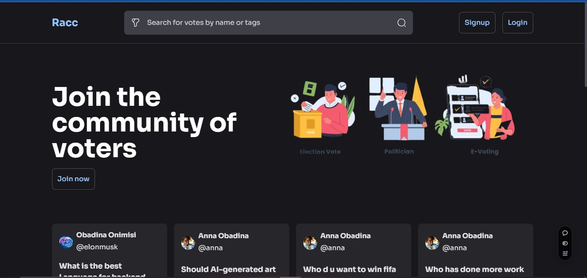

# Racc - An Online Voting Platform

[](https://raccvoting.vercel.app)

## Overview

**Racc is an online voting platform that allows users to create votes and participate in votes**

## Project Structure

```bash
racc_internet_voting_platform/
├── public/        # Public assets folder
├── src/           # Code logic folder
└── README.md      # General overview (this file)
```

## Dev Stacks and Technologies

### Front-End:

- JavaScript
- React
- Vite
- Tailwind CSS
- Shadcn components
- Lucide React
- Sweetalert2
- Iconsax
- Hero icons

### Back-End:

- Appwrite

### Deployment

- Vercel

### Version Control System (VCS)

- Git

## Features

<!-- Blockchain Integration: Immutable message storage and retrieval on the blockchain.
User Authentication: Wallet-based login for secure and decentralized access.
Community Interaction: View and search for messages left by other users.
Guided Onboarding: A how-to page to help new users get started with blockchain.
Responsive UI: Optimized for all devices with Tailwind CSS.
Custom Notifications: Real-time feedback for user actions. -->

- __User Authentication:__ A signup and login authentication using appwrite's Account and Databases feature.
- __App Interface and Repsonsiveness:__ Designed with Tailwind CSS and shascn ui component libraries.
- __Image Upload:__ Available for profile and votes.
- __Vote Notification:__ Shows notification for vote participation count.
- __Vote Casting Logic:__ Implemented with React and prevents users from voting twice.

## Getting Started

### Prerequisites

- Node.js
- Appwrite Cloud Account
- `npm`

### Installation

1. Clone the repository.

```bash
git clone https://github.com/fisayo-dev/racc.git
```

2. Install the dependencies.

```bash
npm install # for npm
```

3. Start the development server.

```bash
npm run dev
```

### Connecting To Appwrite

1. Go to env.example file
2. Create one database
3. Create three collections for users, notifications and votes.
4. Look through the source code to guide you in creating the attributes for each collections.
5. Create two storage buckets for vote image and profile images.
6. Insert the ids of all the collections and bucket following the format in the env.example file

------

------

## Contributions

This projet is an open-source project and I am glad to accept contributions. You can submit issues, fork the repository, and create pull requests.

## Developer

This developer behind this project is Fisayo Obadina. For more info: follow me on [Twitter(X)](https://x.com/fisayocoder) and [Linked-In](https://www.linkedin.com/in/fisayo-obadina-a38614267/).
